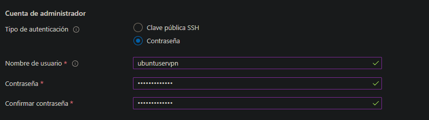

[Spanish version](#spanish)

# 🛡️ VPN Setup on Azure with WireGuard

<p align="justify">
Detailed guide to create a Virtual Private Network (VPN) on an Azure Virtual Machine (VM) using WireGuard. This will allow you to have a secure and private connection to the internet or your resources in Azure.
</p>


*Conceptual illustration of a VPN on Azure.*

---

## ✨ Optional: Azure for Students (VM with no initial cost)

<p align="justify">
To minimize costs during server infrastructure development and testing, you can use an Azure for Students account. This option does not require a credit card for initial registration.
</p>

-   **Register at:** [Azure for Students](https://azure.microsoft.com/es-es/free/students)

---

## 🛠️ Setup Steps

Follow these steps to configure your VPN:

### Step 1: Create the Virtual Machine (VPS) in Azure

First, you need to create a Virtual Machine in your Azure account.

1.  Access the Azure portal and follow the wizard to create a new VM (Ubuntu Server is a good option).
2.  Make sure to set up a username and an authentication method (password or SSH key).

<p align="center">
  
  <br>
  <em>Example of the process of creating a Virtual Machine in Azure.</em>
</p>

### Step 2: Connect to the VM via SSH

Once your VM is running, connect to it using SSH. You will need the public IP address of your VM and the credentials you set up.

```bash
ssh your_user@YOUR_PUBLIC_IP
# Example: ssh diegope@20.123.45.67
```

Replace your_user with your username and YOUR_PUBLIC_IP with your VM's public IP.

### Step 3: Configure Network Rules in Azure (Network Security Group)

It is crucial to configure inbound rules in the Network Security Group (NSG) associated with your VM to allow the necessary traffic.
You must open the following ports:

- TCP 80: For HTTP traffic (optional, if you will host a web server).
- TCP 443: For HTTPS traffic (optional, if you will host a secure web server).
- UDP 51820: Essential port for WireGuard.

> **Note:** ⚠️ **VERY IMPORTANT!** Make sure to open UDP port 51820 in the Azure Firewall (via the NSG). This is the port used by WireGuard for communication. Without this rule, the VPN will not work.

<p align="center">

<br>
<em>Example of configuring inbound rules in an Azure Network Security Group.</em>
</p>

### Step 4: Install WireGuard on the Server (Azure VM)

We will use an installation script to simplify the process. You can find the script and more details in the [wireguard-install](https://github.com/JLalib/wireguard-install) repository.

Install WireGuard using the following commands:
1. Download the installation script:
  
```bash
wget -O wireguard.sh https://get.vpnsetup.net/wg
```
Run the script. You have two options:

* **Option 1 (Recommended):**  Automatic installation with default options.

```bash
sudo bash wireguard.sh --auto
```

* **Option 2:** Interactive installation to customize options (port, DNS, etc.)

```bash
sudo bash wireguard.sh
```
2. Once the installation is complete, the script will show the location of the client configuration file (usually a .conf file) and/or a QR code.
  
3. Exit the SSH session:

```bash
exit
```

### Step 5: Download the Client Configuration File (.conf)

The WireGuard installation script generates a `.conf` configuration file for each client (your local machine). You need to transfer this file from your Azure VM to your computer.

A useful tool for this on Windows is [WinSCP](https://winscp.net/eng/download.php), a graphical SFTP/SCP client. For macOS and Linux, you can use the scp command or SFTP clients like FileZilla.

1. Download and install WinSCP (or your preferred SFTP client).
<p align="center">

<br>
<em>WinSCP download page.</em>
</p>

2. Connect to your Azure VM using WinSCP (Host: YOUR_PUBLIC_IP, User: your_user, Port: 22).

3. Navigate to the location of the .conf file (usually in the home directory of the user who ran the script, e.g. /root/client.conf or /home/your_user/client.conf) and download it to your local PC.
<p align="center">

<br>
<em>Example of downloading the <code>.conf</code> configuration file using WinSCP.</em>
</p>

### Step 6: Install WireGuard on Your Local Machine and Import Configuration

Now, install the WireGuard client on your personal computer.

1. Download and install the WireGuard client for your operating system from [WireGuard](https://www.wireguard.com/install/)

<p align="center">

<br>
<em>Official WireGuard download page.</em>
</p>

2. Open the WireGuard application on your local machine.
<p align="center">

<br>
<em>Main interface of the WireGuard client.</em>
</p>

3. Import the .conf file you downloaded in the previous step. Generally, this is done by clicking "Import tunnel(s) from file" or dragging the .conf file into the application.
<p align="center">

<br>
<em>Process of importing the client configuration file.</em>
</p>

4. Activate the VPN connection.
<p align="center">

<br>
<em>Congratulations! Your WireGuard VPN is active and working.</em>
</p>

# 🎥 Support Video Resources

> 💡 These resources can help you better visualize and understand the implementation process.

---

## 1️⃣ **VPS Azure VPN**

🔗 [CREATE YOUR OWN VPN on VPS for LESS than 1€ per MONTH | #WIREGUARD and #OPENVPN on a #VPS SERVER ](https://www.youtube.com/watch?v=ewjbTCqaRfY)  
Step-by-step explanation to set up an Azure VPS VPN with WireGuard and OpenVPN

🔄 Alternative: OpenVPN  
If you prefer to use OpenVPN instead of WireGuard, it is also a viable option. The process is similar, but you will use a different installation script.  
The installation steps for OpenVPN can be found in the GitHub repository: [openvpn-install](https://github.com/JLalib/openvpn-install) by Nyr (Note: the original JLalib/openvpn-install link seems to be a fork or a different version, Nyr's is the most popular and maintained).

---

Created by [Diego Ivan Perea Montealegre](https://github.com/diegoperea20)

---


# Spanish

# 🛡️ Configuración de VPN en Azure con WireGuard

<p align="justify">
Guía detallada para crear una Red Privada Virtual (VPN) en una Máquina Virtual (VM) de Azure utilizando WireGuard. Esto te permitirá tener una conexión segura y privada a internet o a tus recursos en Azure.
</p>


*Ilustración conceptual de una VPN en Azure.*

---

## ✨ Opcional: Azure for Students (VM sin coste inicial)

<p align="justify">
Para minimizar costes durante el desarrollo y pruebas de la infraestructura del servidor, puedes utilizar una cuenta de Azure for Students. Esta opción no requiere una tarjeta de crédito para el registro inicial.
</p>

-   **Regístrate en:** [Azure for Students](https://azure.microsoft.com/es-es/free/students)

---

## 🛠️ Pasos para la Configuración

Sigue estos pasos para configurar tu VPN:

### Paso 1: Crear la Máquina Virtual (VPS) en Azure

Primero, necesitas crear una Máquina Virtual en tu cuenta de Azure.

1.  Accede al portal de Azure y sigue el asistente para crear una nueva VM (Ubuntu Server es una buena opción).
2.  Asegúrate de configurar un nombre de usuario y un método de autenticación (contraseña o clave SSH).

<p align="center">
  
  <br>
  <em>Ejemplo del proceso de creación de una Máquina Virtual en Azure.</em>
</p>

### Paso 2: Conectar a la VM vía SSH

Una vez que tu VM esté en funcionamiento, conéctate a ella utilizando SSH. Necesitarás la dirección IP pública de tu VM y las credenciales que configuraste.

```bash
ssh tu_usuario@TU_IP_PUBLICA
# Ejemplo: ssh diegope@20.123.45.67
```

Reemplaza tu_usuario con tu nombre de usuario y TU_IP_PUBLICA con la IP pública de tu VM.

### Paso 3 Configurar Reglas de Red en Azure (Grupo de Seguridad de Red)

Es crucial configurar las reglas de entrada en el Grupo de Seguridad de Red (NSG) asociado a tu VM para permitir el tráfico necesario.
Debes abrir los siguientes puertos:

- TCP 80: Para tráfico HTTP (opcional, si vas a alojar un servidor web).
- TCP 443: Para tráfico HTTPS (opcional, si vas a alojar un servidor web seguro).
- UDP 51820: Puerto esencial para WireGuard.

> **Note:** ⚠️ **¡MUY IMPORTANTE!** Asegúrate de abrir el puerto UDP 51820 en el Firewall de Azure (a través del NSG). Este es el puerto que utiliza WireGuard para la comunicación. Sin esta regla, la VPN no funcionará.


<p align="center">

<br>
<em>Ejemplo de configuración de reglas de entrada en un Grupo de Seguridad de Red de Azure.</em>
</p>


### Paso 4: Instalar WireGuard en el Servidor (VM de Azure)

Vamos a utilizar un script de instalación para facilitar el proceso. Puedes encontrar el script y más detalles en el repositorio  [wireguard-install](https://github.com/JLalib/wireguard-install)

Install WireGuard using the following commands:
1. Descarga el script de instalación:
  
```bash
wget -O wireguard.sh https://get.vpnsetup.net/wg
```
Ejecuta el script. Tienes dos opciones:

* **Opción 1 (Recomendada):**  Instalación automática con opciones por defecto.

```bash
sudo bash wireguard.sh --auto
```

* **Opción 2:** Instalación interactiva para personalizar opciones (puerto, DNS, etc.)

```bash
sudo bash wireguard.sh
```
2. Una vez finalizada la instalación, el script mostrará la ubicación del archivo de configuración del cliente (normalmente un archivo .conf) y/o un código QR.
  
3. Sal de la sesión SSH:

```bash
exit
```

### Paso 5: Descargar el Archivo de Configuración del Cliente (.conf)

El script de instalación de WireGuard genera un archivo de configuración `.conf` para cada cliente (tu máquina local). Necesitas transferir este archivo desde tu VM de Azure a tu ordenador.

Una herramienta útil para esto en Windows es [WinSCP](https://winscp.net/eng/download.php) un cliente SFTP/SCP gráfico. Para macOS y Linux, puedes usar el comando scp o clientes SFTP como FileZilla.


1. Descarga e instala WinSCP (o tu cliente SFTP preferido).
<p align="center">

<br>
<em>Página de descarga de WinSCP.</em>
</p>

2. Conéctate a tu VM de Azure usando WinSCP (Host: TU_IP_PUBLICA, Usuario: tu_usuario, Puerto: 22).

3. Navega hasta la ubicación del archivo .conf (generalmente en el directorio home del usuario que ejecutó el script, por ejemplo /root/client.conf o /home/tu_usuario/client.conf) y descárgalo a tu PC local.
<p align="center">

<br>
<em>Ejemplo de descarga del archivo de configuración <code>.conf</code> usando WinSCP.</em>
</p>

### Paso 6: Instalar WireGuard en tu Máquina Local e Importar Configuración

Ahora, instala el cliente WireGuard en tu ordenador personal.

1. Descarga e instala el cliente WireGuard para tu sistema operativo desde [WireGuard](https://www.wireguard.com/install/)

<p align="center">

<br>
<em>Página de descarga oficial de WireGuard.</em>
</p>

2. Abre la aplicación WireGuard en tu máquina local.
<p align="center">

<br>
<em>Interfaz principal del cliente WireGuard.</em>
</p>

3. Importa el archivo .conf que descargaste en el paso anterior. Generalmente, esto se hace haciendo clic en "Importar túnel(es) desde archivo" o arrastrando el archivo .conf a la aplicación.
<p align="center">

<br>
<em>Proceso de importación del archivo de configuración del cliente.</em>
</p>

4. Activa la conexión VPN.
<p align="center">

<br>
<em>¡Felicidades! Tu VPN WireGuard está activa y funcionando.</em>
</p>


# 🎥 Videos de fuente de apoyo

> 💡 Estos recursos pueden ayudarte a visualizar y comprender mejor el proceso de implementación.

---

## 1️⃣ **VPS Azure VPN**

🔗 [CREA TU PROPIA VPN en VPS por MENOS de 1€ al MES | #WIREGUARD y #OPENVPN en un SERVIDOR #VPS ](https://www.youtube.com/watch?v=ewjbTCqaRfY)  
Explicación paso a paso para montar un VPS Azure VPN con WireGuard y OpenVPN

🔄 Alternativa: OpenVPN
Si prefieres utilizar OpenVPN en lugar de WireGuard, también es una opción viable. El proceso es similar, pero utilizarás un script de instalación diferente.
Los pasos de instalación para OpenVPN se pueden encontrar en el repositorio de GitHub: [openvpn-install](https://github.com/JLalib/openvpn-install) de Nyr (Nota: el enlace original JLalib/openvpn-install parece ser un fork o una versión diferente, el de Nyr es el más popular y mantenido).


---

Created by [Diego Ivan Perea Montealegre](https://github.com/diegoperea20)

---